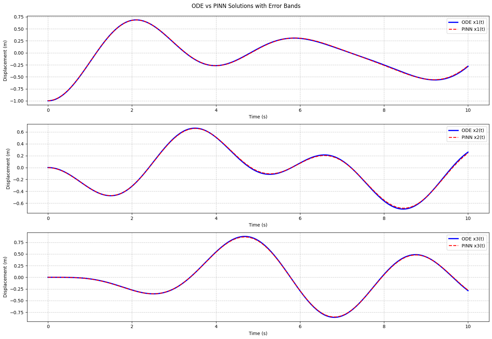

# Physics-Informed-Neural-Network

This repository contains a PyTorch implementation of a Physics-Informed Neural Network (PINN) designed to solve the equations of motion for a coupled mass-spring system.

The model learns to predict the positions of the masses over time by embedding the governing ordinary differential equations (ODEs) directly into the neural network's loss function. This approach allows the network to find a physically accurate solution without relying on any pre-generated simulation data.

## ✨ Core Concepts

### What is a PINN?
A **Physics-Informed Neural Network (PINN)** is a neural network that is trained to solve supervised learning tasks while respecting known physical laws described by differential equations. Instead of just minimizing the error against data points, the loss function also includes a term that measures how well the network's output satisfies the physical equations. A key component is **automatic differentiation**, which allows for the exact computation of the derivatives required to evaluate these equations.

### The Physical System
The project models a linear chain of 3 masses connected by springs. The motion of each mass is governed by Newton's second law, resulting in a system of coupled second-order ODEs:

$$
\ddot{x}_i(t) = \alpha (x_{i-1}(t) - 2x_i(t) + x_{i+1}(t))
$$

where:
* $x_i(t)$ is the position of the $i$-th mass at time $t$.
* $\ddot{x}_i$ is the acceleration of the $i$-th mass.
* $\alpha = k/m$ is the ratio of the spring constant to the mass.

## 🛠️ Loss Function

The custom loss function is the heart of the PINN and consists of two main components:

1.  **Physics Loss (`physics_loss`):** This is the residual of the governing ODEs. It measures how well the network's output $x(t)$ satisfies the physical laws. The second derivatives ($\ddot{x}$) are calculated using `torch.autograd.grad`.
2.  **Initial Condition Loss (`initial_condition_loss`):** This ensures the solution adheres to the specified initial conditions for position $x(0)$ and velocity $\dot{x}(0)$.

The total loss is a weighted sum of these two components, which the optimizer works to minimize.
